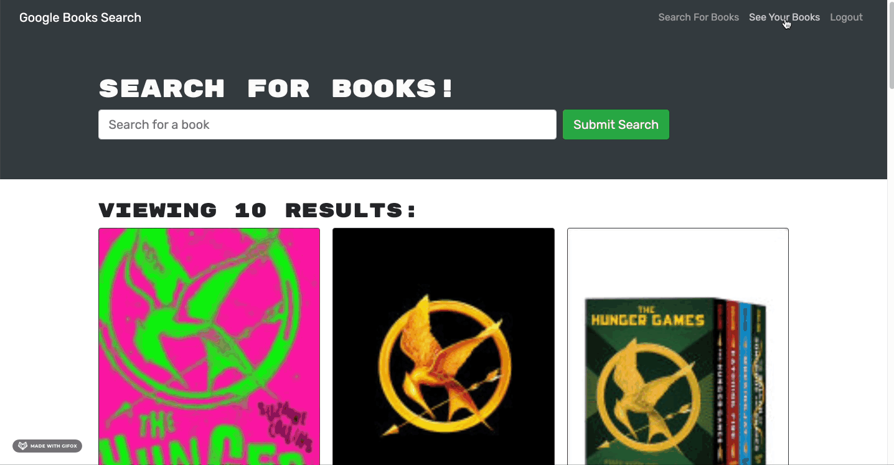

# Book For You [](http://unlicense.org/)

## Description
Book For You is a book search engine that allows users to login and catalog their book searches. This app utilizes Apollo Server to use GraphQl, replacing an existing RESTful API. 

## Table of Contents
1. [Description](#description)
2. [Technologies](#Technologies)
3. [Installation](#installation)
4. [Deployment](#deployment)
5. [Usage](#usage)
6. [License](#License)
7. [Contributing](#Contributing)
8. [Author](#Author)

## Technologies
```
React | MongoDB | Mongodb Atlas | Mongoose | Heroku | Express | Apollo service express | Apollo Client | Bootstrap | GraphQL | jwt-decode | json web token | bcrypt
```

## Installation
1. For development purposes, clone the repo locally.
2. Install npm packages at root of application.
```
  npm install
```
3. Then, run locally.
```
  npm run develop
```

## Deployment
* [Heroku Link](https://book-for-you-ronancodes.herokuapp.com/)

## Usage
1. Access the deployed application [here](https://book-for-you-ronancodes.herokuapp.com/). Signup/login to utilize all of the features. 

2. Once logged in, users can utilize the search feature. The app loads data from the Google Books API. Users then have the option to save any book by clicking the `Save this Book!` button.


4. To view all of the books saved, navigate to the `See Your Books` section. From there, users can remove books by clicking the `Delete this Book!` button. 


## License
This project is in the public domain and free for any and all users! For more information on this (un)licensing statement, visit [unlicense.org](https://unlicense.org/).

## Contributing
* If you'd like to contribute to this project, please follow the rules of the [Contributor Covenant](https://www.contributor-covenant.org/).

## Author
* This application was written and developed by Ronan Galvez as part of the UCF Coding Bootcamp.
* For any inquiries/suggestions/concerns, open an issue in the [project repo](https://github.com/Ronan-Codes/book-for-you.git) or contact me directly at [galv.ronan@gmail.com](galv.ronan@gmail.com).
* Check out the rest of my work on GitHub at [Ronan-Codes](https://github.com/Ronan-Codes).